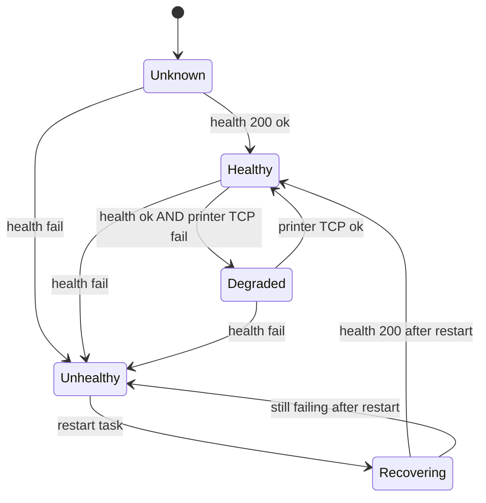

# BP RX Print Bridge — Windows Monitor App

> **Implemented:** native tray app lives in [`windows-monitor/`](../../windows-monitor/) at the repo root.  
> Build on Windows with `windows-monitor/build.bat` → `publish/BpRx.BridgeMonitor.exe`

Planning notes below remain useful for future milestones (auto-restart, MSI, etc.).

---

This repo (`bp-rx-sticker`) keeps the bridge itself: `extension/print-bridge/server.js`, `start-bridge.ps1`, and the `BP-RX-PrintBridge` scheduled task.

---

## Problem

Today the print bridge is:

- Installed via `install-windows.ps1` as scheduled task `BP-RX-PrintBridge`
- Started at user logon by `start-bridge.ps1`
- Configured per machine in `config.local.env` (printer IP, ports)
- Logged to `extension/print-bridge/logs/`

When something goes wrong (Node hung, printer unreachable, task stopped), technicians have little visibility. A small native Windows app can close that gap.

---

## Goals

| Priority | Capability |
|----------|------------|
| P0 | Tray icon: green / yellow / red from bridge health |
| P0 | Poll `GET http://127.0.0.1:9101/health` on an interval |
| P0 | Restart bridge: `Stop-ScheduledTask` + `Start-ScheduledTask` for `BP-RX-PrintBridge` |
| P1 | Open today's bridge log file (`logs/bridge-YYYY-MM-DD.log`) |
| P1 | Show last error from health / print response |
| P1 | Optional TCP probe to `PRINTER_IP:9100` (config read from `config.local.env`) |
| P2 | Windows toast when bridge is down for N minutes |
| P2 | Write monitor events to its own log (`%ProgramData%\BP-RX\monitor.log`) |
| P2 | Settings UI: bridge URL, poll interval, auto-restart policy |
| P3 | Remote check-in (heartbeat to internal API) for IT dashboard |
| P3 | MSI / silent deploy for enterprise Chrome rollout |

---

## Non-goals (v1)

- Replacing the Node bridge (keep HTTP → raw TCP :9100)
- Managing Chrome extension settings (extension options page stays separate)
- Printing ZPL directly from the monitor app

---

## Suggested stack (separate repo)

**Option A — .NET 8 WinForms / WPF tray app** (recommended for pharmacy IT familiarity)

- `NotifyIcon` in system tray
- `HttpClient` for health checks
- `Microsoft.Win32.TaskScheduler` or PowerShell for task restart
- Single-file publish: `bp-rx-bridge-monitor.exe`

**Option B — Tauri / Electron**

- Heavier runtime; only if you already standardize on web UI for internal tools

**Option C — Windows Service + minimal tray**

- Service does polling/restart; tray is optional UI — best for “always on” without user logon (only if bridge task also runs as service)

Start with **Option A**: smallest footprint, easy scheduled-task integration, no Node dependency for the monitor itself.

---

## Contracts with this repo

### Health endpoint

```
GET http://127.0.0.1:9101/health
→ 200 { "ok": true, "printerIp": "172.18.129.123", "printerPort": 9100 }
```

Monitor should treat non-200 or `ok: false` as unhealthy.

### Print smoke test (optional, manual)

```
POST http://127.0.0.1:9101/print
Content-Type: text/plain
Body: minimal ZPL ^XA^FO50,50^ADN,36,20^FDTEST^FS^XZ
```

Use sparingly — wastes label stock. Prefer health + TCP connect only for automation.

### Config file (read-only for monitor)

Path (relative to repo clone on workstation):

```
extension/print-bridge/config.local.env
```

Keys:

| Key | Example |
|-----|---------|
| `PRINTER_IP` | `172.18.129.123` |
| `PRINTER_PORT` | `9100` |
| `PRINT_BRIDGE_HOST` | `127.0.0.1` |
| `PRINT_BRIDGE_PORT` | `9101` |

Install script may later copy a pointer to `%ProgramData%\BP-RX\config.json` so the monitor does not depend on repo path — document that when implemented.

### Logs (read-only for monitor)

| File | Purpose |
|------|---------|
| `extension/print-bridge/logs/bridge-YYYY-MM-DD.log` | Bridge stdout/stderr via `start-bridge.ps1` |
| `extension/print-bridge/logs/install-*.log` | Installer runs |

### Scheduled task

| Property | Value |
|----------|--------|
| Name | `BP-RX-PrintBridge` |
| Action | `powershell -File start-bridge.ps1` |
| Trigger | At logon |
| Restart | 3×, 1 minute apart |

Restart sequence for monitor:

```powershell
Stop-ScheduledTask -TaskName 'BP-RX-PrintBridge' -ErrorAction SilentlyContinue
Start-Sleep -Seconds 2
Start-ScheduledTask -TaskName 'BP-RX-PrintBridge'
Start-Sleep -Seconds 3
# re-probe /health
```

---

## Health state machine



| State | Tray | Action |
|-------|------|--------|
| Healthy | Green | Poll only |
| Degraded | Yellow | Show “printer unreachable”; optional retry |
| Unhealthy | Red | Auto-restart after N failures (configurable) |
| Recovering | Blue/spinner | Restart task once per cooldown window |

Suggested defaults:

- Poll interval: **15 s**
- Auto-restart after: **3 consecutive health failures**
- Restart cooldown: **5 min** (avoid restart loops)

---

## Repo layout (proposed new project)

```
bp-rx-bridge-monitor/
  src/
    BpRx.BridgeMonitor/          # WinForms or WPF tray app
    BpRx.BridgeMonitor.Core/     # health, config, task restart (testable)
  tests/
    BridgeMonitor.Core.Tests/
  installer/
    wix/ or Inno Setup script
  README.md
  docs/
    DEPLOY.md
```

### Core interfaces (C# sketch)

```csharp
public interface IBridgeHealthClient {
  Task<BridgeHealth> GetHealthAsync(CancellationToken ct);
}

public interface IBridgeSupervisor {
  Task<RestartResult> RestartBridgeAsync(CancellationToken ct);
}

public interface IPrinterProbe {
  Task<bool> CanConnectAsync(string ip, int port, CancellationToken ct);
}
```

---

## Deployment notes

1. Install Node bridge first: `install-windows.bat` (or with printer IP argument).
2. Install monitor app (per-machine MSI or portable exe).
3. Monitor reads `config.local.env` or `%ProgramData%\BP-RX\settings.json`.
4. Optional: register monitor to start at logon (separate scheduled task or Startup folder).

Document printer IP changes:

- Re-run `install-windows.bat 172.18.x.x`, **or**
- Edit `config.local.env` and restart `BP-RX-PrintBridge` task, **or**
- Future: monitor settings UI writes the same file and triggers restart.

---

## Open questions

1. **Repo path on disk** — is the extension always cloned to the same path on every PC, or should install copy bridge files to `%ProgramData%\BP-RX\bridge\`?
2. **Multi-user workstations** — scheduled task is per-user logon today; should bridge run as SYSTEM?
3. **Alerting** — tray only vs email/Teams webhook when down > 10 min?
4. **Code signing** — SmartScreen for unsigned internal exe?

---

## Milestones

### v0.1 — “Is it up?”

- Tray icon + health poll
- Open log folder
- Manual “Restart bridge”

### v0.2 — “Fix it for me”

- Auto-restart with cooldown
- Printer TCP probe → degraded state
- Read `config.local.env`

### v1.0 — IT-ready

- Installer, `%ProgramData%` config
- Event log entries on restart
- Deployment doc for pharmacy rollout

---

## Related files in this repo

| File | Role |
|------|------|
| `extension/print-bridge/server.js` | HTTP bridge |
| `extension/print-bridge/start-bridge.ps1` | Task entrypoint + file logging |
| `extension/print-bridge/install-windows.ps1` | Task install + `config.local.env` |
| `extension/print-bridge/install-windows.bat` | Admin-friendly launcher |
| `extension/print-bridge/config.local.env.example` | Config template |
| `extension/lib/printConfig.js` | Extension default printer IP (keep in sync manually until shared config) |

---

*Last updated: June 30, 2026 — created alongside install script logging + configurable printer IP.*
